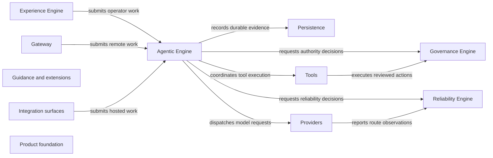

# Repository graph

This bounded map is generated from NNA's production JavaScript. It is a navigation aid, not an authority source: code and accepted architecture decisions remain authoritative. The complete module adjacency list lives in [repository-graph.json](repository-graph.json).

Rebuild with `npm run graph:build`. Use `npm run graph:check` for a focused check; the normal `npm run check` gate also fails when source relationships drift from the committed graph. Generated artifacts contain only repository-relative paths, declared component ownership, static local imports, and Node.js module names.

## Ownership topology

This diagram captures the intended engine boundaries. The tables below are measured from imports.

## Component inventory

| Component | Modules | Imports from | Imported by |
|---|---:|---|---|
| Agentic Engine | 22 | Agentic Engine, Governance Engine, Guidance and extensions, Integration surfaces, Persistence, Product foundation, Providers, Reliability Engine, Tools | Agentic Engine, Experience Engine, Gateway, Integration surfaces, Product foundation, Tools |
| Governance Engine | 10 | Governance Engine, Persistence, Product foundation, Reliability Engine, Tools | Agentic Engine, Experience Engine, Governance Engine, Guidance and extensions, Product foundation, Tools |
| Experience Engine | 88 | Agentic Engine, Experience Engine, Gateway, Governance Engine, Guidance and extensions, Integration surfaces, Persistence, Product foundation, Providers, Reliability Engine, Tools | Experience Engine, Product foundation |
| Reliability Engine | 35 | Product foundation, Providers, Reliability Engine, Tools | Agentic Engine, Experience Engine, Gateway, Governance Engine, Persistence, Product foundation, Providers, Reliability Engine, Tools |
| Gateway | 4 | Agentic Engine, Gateway, Integration surfaces, Persistence, Product foundation, Providers, Reliability Engine | Experience Engine, Gateway, Product foundation |
| Persistence | 11 | Persistence, Product foundation, Reliability Engine | Agentic Engine, Experience Engine, Gateway, Governance Engine, Integration surfaces, Persistence, Product foundation, Providers, Tools |
| Providers | 18 | Persistence, Product foundation, Providers, Reliability Engine | Agentic Engine, Experience Engine, Gateway, Integration surfaces, Product foundation, Providers, Reliability Engine |
| Tools | 44 | Agentic Engine, Governance Engine, Guidance and extensions, Integration surfaces, Persistence, Product foundation, Reliability Engine, Tools | Agentic Engine, Experience Engine, Governance Engine, Product foundation, Reliability Engine, Tools |
| Guidance and extensions | 9 | Governance Engine, Guidance and extensions, Product foundation | Agentic Engine, Experience Engine, Guidance and extensions, Product foundation, Tools |
| Integration surfaces | 10 | Agentic Engine, Integration surfaces, Persistence, Product foundation, Providers | Agentic Engine, Experience Engine, Gateway, Integration surfaces, Product foundation, Tools |
| Product foundation | 83 | Agentic Engine, Experience Engine, Gateway, Governance Engine, Guidance and extensions, Integration surfaces, Persistence, Product foundation, Providers, Reliability Engine, Tools | Agentic Engine, Experience Engine, Gateway, Governance Engine, Guidance and extensions, Integration surfaces, Persistence, Product foundation, Providers, Reliability Engine, Tools |

## Strongest observed component dependencies

Counts represent static local imports. Same-component imports are included because they reveal the internal cohesion of each subsystem.

| Importer | Imported component | Imports | Importing modules |
|---|---|---:|---:|
| Experience Engine | Experience Engine | 159 | 52 |
| Product foundation | Product foundation | 150 | 71 |
| Experience Engine | Product foundation | 81 | 57 |
| Tools | Product foundation | 56 | 36 |
| Tools | Tools | 54 | 20 |
| Reliability Engine | Reliability Engine | 45 | 17 |
| Agentic Engine | Product foundation | 41 | 16 |
| Agentic Engine | Agentic Engine | 33 | 10 |
| Providers | Product foundation | 23 | 16 |
| Integration surfaces | Product foundation | 16 | 10 |
| Experience Engine | Providers | 13 | 8 |
| Agentic Engine | Reliability Engine | 12 | 6 |
| Agentic Engine | Tools | 12 | 7 |
| Governance Engine | Product foundation | 12 | 10 |
| Persistence | Product foundation | 11 | 10 |
| Providers | Providers | 11 | 6 |
| Reliability Engine | Product foundation | 11 | 10 |
| Tools | Reliability Engine | 11 | 4 |
| Product foundation | Providers | 10 | 8 |
| Guidance and extensions | Product foundation | 9 | 8 |
| Experience Engine | Persistence | 8 | 7 |
| Product foundation | Experience Engine | 8 | 5 |
| Product foundation | Persistence | 8 | 6 |
| Integration surfaces | Integration surfaces | 8 | 4 |

## Process entry points

- `src/cli.js`
- `src/elevation-helper.js`
- `src/forensic-telemetry-worker.js`
- `src/index.js`
- `src/update-check-worker.js`

Source fingerprint: `sha256:b84f501adca535cdebf9afd9309537063d85fec723d7c9dc49d235895a62d8de`.
