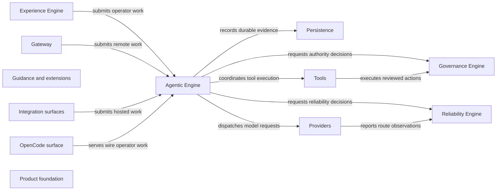

# Repository graph

This bounded map is generated from NNA's production JavaScript. It is a navigation aid, not an authority source: code and accepted architecture decisions remain authoritative. The complete module adjacency list lives in [repository-graph.json](repository-graph.json).

Rebuild with `npm run graph:build`. Use `npm run graph:check` for a focused check; the normal `npm run check` gate also fails when source relationships drift from the committed graph. Generated artifacts contain only repository-relative paths, declared component ownership, static local imports, and Node.js module names.

## Ownership topology

This diagram captures the intended engine boundaries. The tables below are measured from imports.

```mermaid
graph LR
  agentic_engine["Agentic Engine"]
  governance_engine["Governance Engine"]
  experience_engine["Experience Engine"]
  reliability_engine["Reliability Engine"]
  gateway["Gateway"]
  persistence["Persistence"]
  providers["Providers"]
  tools["Tools"]
  guidance["Guidance and extensions"]
  integrations["Integration surfaces"]
  opencode_surface["OpenCode surface"]
  foundation["Product foundation"]
  experience_engine -->|submits operator work| agentic_engine
  gateway -->|submits remote work| agentic_engine
  integrations -->|submits hosted work| agentic_engine
  opencode_surface -->|serves wire operator work| agentic_engine
  agentic_engine -->|requests authority decisions| governance_engine
  agentic_engine -->|requests reliability decisions| reliability_engine
  agentic_engine -->|dispatches model requests| providers
  agentic_engine -->|records durable evidence| persistence
  agentic_engine -->|coordinates tool execution| tools
  tools -->|executes reviewed actions| governance_engine
  providers -->|reports route observations| reliability_engine
```

## Component inventory

| Component | Modules | Imports from | Imported by |
|---|---:|---|---|
| Agentic Engine | 26 | Agentic Engine, Governance Engine, Guidance and extensions, Integration surfaces, Persistence, Product foundation, Providers, Reliability Engine, Tools | Agentic Engine, Experience Engine, Gateway, Integration surfaces, OpenCode surface, Product foundation, Tools |
| Governance Engine | 12 | Governance Engine, Persistence, Product foundation, Reliability Engine, Tools | Agentic Engine, Experience Engine, Governance Engine, Guidance and extensions, Product foundation, Tools |
| Experience Engine | 98 | Agentic Engine, Experience Engine, Gateway, Governance Engine, Guidance and extensions, Integration surfaces, Persistence, Product foundation, Providers, Reliability Engine, Tools | Experience Engine, Integration surfaces, Product foundation, Providers |
| Reliability Engine | 37 | Product foundation, Providers, Reliability Engine, Tools | Agentic Engine, Experience Engine, Gateway, Governance Engine, Integration surfaces, OpenCode surface, Persistence, Product foundation, Providers, Reliability Engine, Tools |
| Gateway | 4 | Agentic Engine, Gateway, Integration surfaces, Persistence, Product foundation, Providers, Reliability Engine | Experience Engine, Gateway, Product foundation |
| Persistence | 15 | Persistence, Product foundation, Reliability Engine | Agentic Engine, Experience Engine, Gateway, Governance Engine, Integration surfaces, OpenCode surface, Persistence, Product foundation, Providers, Tools |
| Providers | 23 | Experience Engine, Persistence, Product foundation, Providers, Reliability Engine | Agentic Engine, Experience Engine, Gateway, Integration surfaces, OpenCode surface, Product foundation, Providers, Reliability Engine |
| Tools | 50 | Agentic Engine, Governance Engine, Guidance and extensions, Integration surfaces, Persistence, Product foundation, Reliability Engine, Tools | Agentic Engine, Experience Engine, Governance Engine, Integration surfaces, Product foundation, Reliability Engine, Tools |
| Guidance and extensions | 9 | Governance Engine, Guidance and extensions, Product foundation | Agentic Engine, Experience Engine, Guidance and extensions, Integration surfaces, Product foundation, Tools |
| Integration surfaces | 10 | Agentic Engine, Experience Engine, Guidance and extensions, Integration surfaces, Persistence, Product foundation, Providers, Reliability Engine, Tools | Agentic Engine, Experience Engine, Gateway, Integration surfaces, Product foundation, Tools |
| OpenCode surface | 24 | Agentic Engine, OpenCode surface, Persistence, Product foundation, Providers, Reliability Engine | OpenCode surface, Product foundation |
| Product foundation | 213 | Agentic Engine, Experience Engine, Gateway, Governance Engine, Guidance and extensions, Integration surfaces, OpenCode surface, Persistence, Product foundation, Providers, Reliability Engine, Tools | Agentic Engine, Experience Engine, Gateway, Governance Engine, Guidance and extensions, Integration surfaces, OpenCode surface, Persistence, Product foundation, Providers, Reliability Engine, Tools |

## Strongest observed component dependencies

Counts represent static local imports. Same-component imports are included because they reveal the internal cohesion of each subsystem.

| Importer | Imported component | Imports | Importing modules |
|---|---|---:|---:|
| Product foundation | Product foundation | 635 | 188 |
| Experience Engine | Experience Engine | 183 | 59 |
| Experience Engine | Product foundation | 87 | 60 |
| Product foundation | Persistence | 67 | 45 |
| Tools | Product foundation | 62 | 40 |
| Tools | Tools | 58 | 20 |
| Reliability Engine | Reliability Engine | 57 | 21 |
| Agentic Engine | Product foundation | 48 | 18 |
| OpenCode surface | OpenCode surface | 46 | 19 |
| Agentic Engine | Agentic Engine | 41 | 12 |
| Integration surfaces | Product foundation | 38 | 10 |
| Product foundation | Integration surfaces | 31 | 17 |
| Providers | Product foundation | 26 | 18 |
| Product foundation | Experience Engine | 15 | 12 |
| Product foundation | Providers | 15 | 12 |
| OpenCode surface | Product foundation | 15 | 9 |
| Providers | Providers | 15 | 7 |
| Experience Engine | Providers | 14 | 10 |
| Product foundation | Reliability Engine | 14 | 14 |
| Governance Engine | Product foundation | 14 | 12 |
| Agentic Engine | Reliability Engine | 13 | 7 |
| Persistence | Product foundation | 13 | 11 |
| Agentic Engine | Tools | 12 | 7 |
| Reliability Engine | Product foundation | 12 | 11 |

## Process entry points

- `src/cli.js`
- `src/elevation-helper.js`
- `src/forensic-telemetry-worker.js`
- `src/index.js`
- `src/update-check-worker.js`

Source fingerprint: `sha256:d5bb0883a08b985f07cd9ac6fbd38ca9324b97588b118e137ddb1e2bd36b5d22`.
